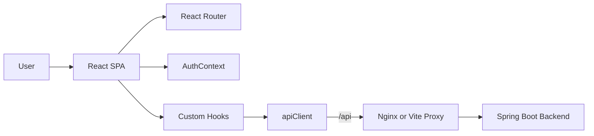
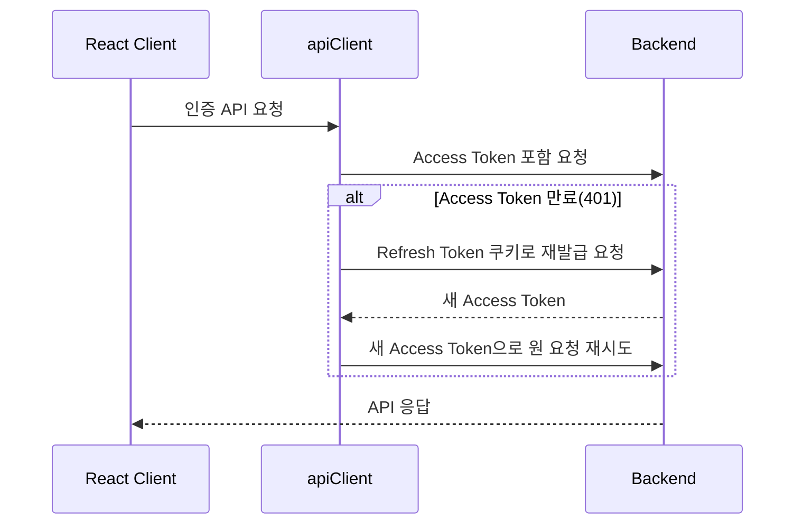

# 🎬 MARTIN MOVIE Frontend

  

> 영화 정보를 탐색하고, 영화 리뷰를 작성·공유할 수 있는 **MARTIN MOVIE**의 React 웹 클라이언트입니다.

  

[Backend Repository](https://github.com/100-hours-a-week/KTB4_Martin_Movie_BE) · [Frontend Repository](https://github.com/100-hours-a-week/KTB4_Martin_Movie_FE)

  

## 프로젝트 소개

  

MARTIN MOVIE는 영화 목록과 상세 정보를 제공하고, 사용자가 리뷰 게시글·댓글·좋아요로 감상을 나눌 수 있는 영화 커뮤니티 서비스입니다. React 기반 SPA로 화면, 사용자 상태, API 연동, 인증 만료 처리, 이미지 미리보기까지 구현했습니다.

  

### 개발 인원 및 기간

  

| 구분 | 내용 |

| --- | --- |

| 개발 기간 | 2026.07.27 ~ 진행 중 |

| 개발 인원 | 프론트엔드 + 백엔드 1명(본인) |

| 담당 | React UI 구현, API 연동, 인증 상태 관리, 페이지네이션·검색 UX, Docker·CI/CD 구성 |

  

## 서비스 시연

  

> 배포 URL 또는 시연 영상 링크를 준비하는 대로 이곳에 추가합니다.

  

## 주요 기능

  

- 회원가입, 로그인, 로그아웃, 회원 정보·비밀번호·프로필 이미지 관리

- 영화 목록·제목 검색·상세 정보 모달·홈 미리보기 조회

- 영화 리뷰 게시글 작성·수정·삭제·검색·페이지네이션

- 댓글 작성·수정·삭제와 페이지 전환 처리

- 게시글 좋아요·취소 및 조회수 반영

- 이미지 첨부파일 업로드·삭제·클라이언트 미리보기

- Access Token 자동 첨부와 Refresh Token 기반 인증 갱신

- 로딩·오류·빈 결과 상태를 화면별로 처리

  

## 기술 스택

  

| 분류 | 기술 |

| --- | --- |

| Language | JavaScript (ES Modules) |

| Framework | React 19, Vite 8 |

| Routing | React Router 7 |

| State | Context API, Custom Hooks |

| HTTP | Fetch API, `AbortController` |

| UI | CSS, Lucide React |

| Utility | UUID |

| Deployment | Docker, Nginx, AWS EC2 |

| CI/CD | GitHub Actions, AWS SSM |

  

## 시스템 아키텍처

  



  

- `pages`: 라우트 단위 화면을 구성합니다.

- `components`: 공통 UI, 영화·게시글·댓글 단위 UI를 분리합니다.

- `hooks`: 데이터 조회·페이지네이션·폼·이미지 미리보기 같은 상태와 동작을 캡슐화합니다.

- `api`: 도메인별 API 요청과 공통 인증·오류 처리를 담당합니다.

- `context`: 로그인 사용자와 인증 상태를 전역으로 공유합니다.

  

## 폴더 구조

  

<details>

<summary>폴더 구조 보기/숨기기</summary>

  

```text

.

├── .github/

│ └── workflows/

│ └── cicd.yml # lint·build·EC2 배포 자동화

├── public/

│ ├── favicon.svg

│ └── icons.svg

├── src/

│ ├── api/ # 인증, 영화, 게시글, 댓글, 첨부파일 API

│ │ └── apiClient.js # 토큰·재발급·공통 오류 처리

│ ├── assets/

│ ├── components/

│ │ ├── common/ # Header, Modal, Pagination, Toast 등

│ │ ├── home/ # 홈 영화·게시글 미리보기

│ │ ├── movie/ # 영화 카드·상세 모달

│ │ └── post/ # 게시글·댓글·좋아요·첨부파일

│ ├── context/

│ │ └── AuthContext.jsx # 전역 인증 상태

│ ├── hooks/ # 화면·도메인 단위 Custom Hook

│ ├── pages/

│ │ ├── home/

│ │ ├── login/

│ │ ├── movies/

│ │ ├── posts/

│ │ ├── post/

│ │ ├── postEditor/

│ │ ├── signup/

│ │ ├── userEdit/

│ │ └── passwordEdit/

│ ├── routes/

│ │ └── router.jsx # 공개·보호 라우트 정의

│ ├── utils/ # 입력·파일·날짜·상영 시간 검증/포맷

│ ├── App.jsx

│ ├── index.css

│ └── main.jsx

├── Dockerfile

├── nginx.conf

├── vite.config.js

├── package.json

└── README.md

```

  

</details>

  

## 구현 기능

  

### 공개 화면

  

| 화면 | 경로 | 주요 기능 |

| --- | --- | --- |

| 홈 | `/` | 영화·게시글 미리보기, 영화 리뷰 이동 |

| 로그인 | `/login` | 이메일·비밀번호 로그인 |

| 회원가입 | `/signup` | 입력값 검증 및 회원가입 |

| 영화 정보 | `/movies` | 영화 목록, 제목 검색, 상세 모달 |

  

### 인증 필요 화면

  

`ProtectedRoute`가 인증되지 않은 사용자의 접근을 로그인 화면으로 전환합니다.

  

| 화면 | 경로 | 주요 기능 |

| --- | --- | --- |

| 영화 리뷰 목록 | `/posts` | 게시글 목록·Elasticsearch 검색·페이지네이션 |

| 게시글 상세 | `/posts/:postId` | 댓글, 좋아요, 첨부파일, 조회수 |

| 게시글 작성 | `/posts/new` | 제목·본문·평점·이미지 입력 |

| 게시글 수정 | `/posts/:postId/edit` | 게시글·첨부파일 수정 |

| 회원 정보 수정 | `/users/me/edit` | 닉네임·이메일·프로필 이미지 수정 |

| 비밀번호 수정 | `/users/me/password` | 현재 비밀번호 검증 및 변경 |

  

## 서비스 화면


#### 홈 · 인증

  

| 홈 | 로그인 | 회원가입 |

![[Pasted image 20260809194734.png]]
![[Pasted image 20260809194745.png]]
![[Pasted image 20260809194804.png]]
#### 영화 정보

  
| 영화 목록·검색 | 영화 상세 모달 |

![[Pasted image 20260809194929.png]]
![[Pasted image 20260809200501.png]]
![[Pasted image 20260809195219.png]]

#### 영화 리뷰

  

| 리뷰 목록·검색 | 게시글 작성 | 게시글 상세 |

![[Pasted image 20260809200645.png]]
![[Pasted image 20260809200708.png]]
![[Pasted image 20260809201328.png]]
  ![[Pasted image 20260809201426.png]]

#### 댓글 · 회원 정보

  

| 댓글 작성·수정 | 회원 정보 수정 | 비밀번호 수정 |

![[Pasted image 20260809201923.png]]
![[Pasted image 20260809202048.png]]
  ![[Pasted image 20260809202107.png]]

## 프론트엔드 설계

  

### 인증 상태와 토큰 재발급

  



  

- Access Token과 사용자 정보를 `localStorage`에 저장하고 `AuthContext`로 전역 공유합니다.

- Refresh Token은 HTTP Only 쿠키로 전달되며 JavaScript에서 직접 접근하지 않습니다.

- 401 응답 시 공통 `apiClient`가 토큰 재발급 후 원래 요청을 한 번 재시도합니다.

- 동시에 여러 요청이 401을 받더라도 `refreshPromise`를 공유해 재발급 요청이 중복되지 않도록 했습니다.

- 재발급에 실패하면 저장된 인증 정보를 지우고 로그인 상태를 해제합니다.

  

### Custom Hook 기반 상태 분리

  

| Hook | 역할 |

| --- | --- |

| `usePosts`, `useMovies` | 목록·검색어·페이지·로딩·오류 상태 관리 |

| `useComments` | 댓글 CRUD, 페이지 이동, 댓글 수 변경 처리 |

| `usePostForm` | 게시글 작성·수정·첨부파일 업로드 및 실패 시 생성 게시글 보상 삭제 |

| `useLike` | 좋아요 요청 중복 방지와 화면 상태 반영 |

| `useImagePreview` | 파일 검증, 중복 파일 방지, Object URL 생성·해제 |

| `usePagination` | 공통 페이지 번호·총 페이지·상단 이동 처리 |

  

### 검색과 페이지네이션 UX

  

- 게시글 검색어는 `/posts/search`로, 영화 제목 검색어는 `/movies/search`로 전달합니다.

- 빈 검색어 제출 시 일반 목록 조회로 돌아갑니다.

- 검색·페이지 변경 시 `AbortController`로 이전 요청을 취소해 늦게 도착한 응답이 화면을 덮어쓰지 않게 했습니다.

- 페이지네이션은 백엔드의 `totalPages`를 기준으로 동작합니다.

- 댓글 작성 후에는 첫 페이지를 새로고침하고, 마지막 페이지의 댓글 삭제로 페이지가 사라지면 유효한 마지막 페이지로 이동합니다.

  

### 이미지 첨부 UX

  

- 업로드 전 `URL.createObjectURL()`로 선택 이미지 미리보기를 제공합니다.

- 이미지 제거·컴포넌트 언마운트 시 `URL.revokeObjectURL()`을 호출해 브라우저 메모리 누수를 방지합니다.

- 각 이미지에 UUID 기반 `Idempotency-Key`를 부여해 재시도 상황의 중복 업로드를 줄입니다.

  

## API 연동

  

개발 환경의 Vite 서버는 `/api` 요청을 `http://localhost:8080`으로 프록시하고 `/api` 접두어를 제거합니다.

  

```text

Browser → /api/posts → Vite Proxy → http://localhost:8080/posts

```

  

운영 환경에서는 통합 Nginx가 `/api` 요청을 Backend 컨테이너로 프록시합니다. API 기본 주소는 `VITE_API_BASE_URL`로 변경할 수 있으며, 기본값은 `/api`입니다.

  

## 실행 방법

  

### 사전 요구 사항

  

- Node.js 22 이상

- npm

  

### 개발 서버

  

```bash

npm ci

npm run dev

```

  

기본 개발 주소는 `http://localhost:5173`입니다. Backend는 `http://localhost:8080`에서 실행 중이어야 합니다.

  

### 린트 및 프로덕션 빌드

  

```bash

npm run lint

npm run build

```

  

빌드 결과물은 `dist/`에 생성됩니다.

  

### Docker 단독 실행

  

```bash

docker build -t martin-frontend .

docker run --rm -p 8081:80 martin-frontend

```

  

브라우저에서 `http://localhost:8081`로 확인할 수 있습니다.

  

> 단독 컨테이너는 정적 파일만 제공합니다. `/api` 프록시는 Backend 저장소의 통합 Docker Compose와 Nginx 환경에서 사용합니다.

  

## CI/CD

  

`main` 브랜치 Pull Request와 Push에서 GitHub Actions가 실행됩니다.

  

1. Node.js 22 환경에서 `npm ci`를 실행합니다.

2. `npm run lint`, `npm run build`로 정적 검사와 빌드를 수행합니다.

3. Push 시 GitHub OIDC로 AWS 임시 자격 증명을 발급합니다.

4. AWS SSM을 통해 EC2에 배포 명령을 전달합니다.

5. EC2의 통합 배포 스크립트가 Frontend·Backend를 갱신하고 Docker Compose 헬스체크를 수행합니다.


## 프로젝트 후기

  

화면 구현에 그치지 않고 인증 상태, API 오류, 비동기 요청 취소, 이미지 미리보기, 페이지네이션처럼 실제 서비스에서 반복되는 상태 문제를 Custom Hook 단위로 분리하는 데 집중했습니다.

  

특히 Access Token과 Refresh Token의 역할을 나누고, 만료 시 재발급·재시도 흐름을 공통 API 클라이언트에 모아 각 화면이 인증 예외 처리에 의존하지 않도록 구성했습니다. 앞으로는 컴포넌트 테스트, 접근성 개선, 낙관적 UI와 오류 복구 UX를 확장할 계획입니다.