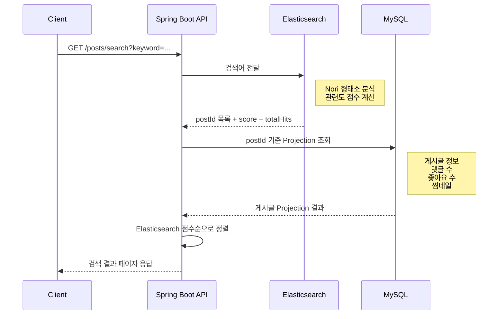
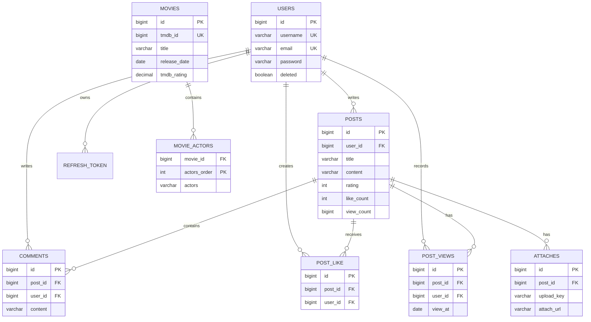

# 🎬 MARTIN MOVIE Backend  
  
> 영화 정보를 탐색하고, 영화 감상과 리뷰를 나눌 수 있는 커뮤니티 서비스의 Spring Boot REST API입니다.  
  
[Frontend Repository](https://github.com/100-hours-a-week/KTB4_Martin_Movie_FE) · [Backend Repository](https://github.com/100-hours-a-week/KTB4_Martin_Movie_BE)  
  
## 프로젝트 소개  
  
**게시글 다이어리** 는 영화 목록·상세 정보를 제공하고 사용자가 영화 리뷰 게시글과 댓글로 소통할 수 있는 서비스입니다.    
회원 인증부터 파일 업로드, 페이지네이션, 검색, AWS 기반 배포까지 API 서버 전반을 구현했습니다.  
  
### 개발 인원 및 기간  
  
| 구분    | 내용                                                 |     |
| ----- | -------------------------------------------------- | --- |
| 개발 기간 | 2026.07.27 ~ 진행 중                                  |     |
| 개발 인원 | 프론트엔드 + 백엔드 1명(본인)                                 |     |
| 담당    | Spring Boot REST API, 데이터 모델링, 검색 기능, AWS 배포 환경 구성 |     |
  
## 서비스 시연  
  
> 배포 URL 또는 시연 영상 링크를 준비하는 대로 이곳에 추가합니다.  
  
## 주요 기능  
  
- JWT Access Token과 Refresh Token 기반 인증 및 토큰 재발급  
- 회원가입, 로그인, 회원 정보·비밀번호·프로필 이미지 관리  
- TMDB 기반 영화 목록, 제목 부분 검색, 상세 정보 및 홈 미리보기 조회  
- 영화 리뷰 게시글·댓글 CRUD 및 페이지네이션  
- 게시글 좋아요, 사용자별 일 단위 조회수, 첨부파일 관리  
- AWS S3 기반 프로필·게시글 이미지 업로드 및 삭제  
- Elasticsearch와 Nori 분석기를 활용한 게시글 제목·본문 검색  
- GitHub Actions와 AWS SSM을 이용한 EC2 컨테이너 배포 자동화  
  
## 기술 스택  
  
| 분류 | 기술 |  
| --- | --- |  
| Language | Java 26 |  
| Framework | Spring Boot 4, Spring MVC, Spring Validation |  
| Security | Spring Security, JWT, BCrypt |  
| Persistence | Spring Data JPA, MySQL 8, H2 |  
| Search | Elasticsearch 9, Nori Analyzer, Spring Data Elasticsearch |  
| Storage | AWS S3 |  
| Deployment | AWS EC2, AWS RDS, AWS SSM, Docker, Docker Compose, Nginx |  
| CI/CD | GitHub Actions |  
| Test | JUnit 5, Spring Boot Test |  
  
## 시스템 아키텍처  
  ![[Pasted image 20260809165515.png]]
- Nginx가 정적 프론트엔드를 제공하고 `/api` 요청을 Backend로 프록시합니다.  
- 운영 환경은 Backend, Frontend, Elasticsearch, Nginx를 Docker Compose로 함께 실행합니다.  
- MySQL은 서비스의 원본 데이터 저장소이며, Elasticsearch는 게시글 검색 전용 인덱스를 보관합니다.  
  
## 폴더 구조  
  
<details>  
<summary>폴더 구조 보기/숨기기</summary>  
  
```text  
.  
├── .github/  
│   └── workflows/  
│       └── cicd.yml                 # 빌드·테스트·EC2 배포 자동화  
├── deploy/  
│   └── deploy.sh                    # EC2 Docker Compose 배포 스크립트  
├── elasticsearch/  
│   └── Dockerfile                   # Nori 플러그인 포함 ES 이미지  
├── nginx/  
│   └── default.conf                 # /api 리버스 프록시 설정  
├── src/  
│   ├── main/  
│   │   ├── java/com/homework4/workapi/  
│   │   │   ├── auth/                # JWT 발급·검증 필터  
│   │   │   ├── config/              # Security, S3, Web 설정  
│   │   │   ├── controller/          # REST Controller  
│   │   │   ├── document/            # Elasticsearch Document  
│   │   │   ├── dto/                 # 요청·응답 DTO  
│   │   │   ├── entity/              # JPA Entity  
│   │   │   ├── event/               # 검색 색인 동기화 이벤트  
│   │   │   ├── exception/, handler/ # 예외 및 전역 예외 처리  
│   │   │   ├── projection/          # 목록 조회 전용 Projection  
│   │   │   ├── repository/          # JPA·Elasticsearch Repository  
│   │   │   ├── service/             # 비즈니스 로직  
│   │   │   └── validation/          # 입력값·이미지 검증  
│   │   └── resources/  
│   │       └── application-*.yaml   # 프로필별 설정  
│   └── test/                        # 단위·서비스 테스트  
├── compose.yaml  
├── Dockerfile  
├── build.gradle  ㅋ
└── README.md  
```  
  
</details>  
  
## 서버 설계  
  
### 계층 구조  
  
| 계층 | 역할 |  
| --- | --- |  
| Controller | HTTP 요청·응답, 인증 사용자 주입, Bean Validation 수행 |  
| Service | 트랜잭션과 도메인 규칙 처리 |  
| Repository | JPA·Elasticsearch를 통한 데이터 접근 |  
| DTO / Projection | API 응답 형식 분리 및 목록 조회 데이터 최소화 |  
| Event | RDS 트랜잭션 커밋 후 Elasticsearch 색인 동기화 |  
  
### 도메인별 구성  
  
| 도메인 | Controller | Service | Repository |  
| --- | --- | --- | --- |  
| 사용자·인증 | `UserController` | `UserService` | `UserRepository`, `RefreshTokenRepository` |  
| 영화 | `MovieController` | `MovieService` | `MovieRepository` |  
| 게시글 | `PostController` | `PostService` | `PostRepository`, `PostLikeRepository`, `PostViewRepository` |  
| 댓글 | `CommentController` | `CommentService` | `CommentRepository` |  
| 첨부파일 | `AttachController` | `AttachService`, `FileService` | `AttachRepository` |  
| 게시글 검색 | `PostController` | `PostSearchService` | `PostSearchRepository`, `PostRepository` |  
  
### 인증·인가 흐름  
  
1. 로그인 성공 시 짧은 수명의 Access Token과 Refresh Token을 발급합니다.  
2. Access Token은 `Authorization: Bearer {token}` 헤더로 전달합니다.  
3. `JwtAuthenticationFilter`가 토큰을 검증하고 사용자 ID를 Spring Security `SecurityContext`에 저장합니다.  
4. Controller는 `@AuthenticationPrincipal`로 인증된 사용자 ID를 전달받아 작성자 검증을 수행합니다.  
5. Refresh Token은 HTTP Only 쿠키와 DB에 저장하고, 재발급 시 회전시킵니다.  
  
### 페이지네이션과 목록 조회  
  
- 영화는 페이지당 9개, 게시글은 10개, 댓글은 20개를 반환합니다.  
- `PageResponse`가 Spring Data `Page`를 공통 API 형식으로 변환합니다.  
- 게시글 목록은 `PostListProjection`으로 필요한 컬럼만 조회합니다.  
- 댓글 수·좋아요 여부·첨부파일 썸네일은 게시글 ID 묶음으로 추가 조회해 목록 렌더링 시 N+1 쿼리를 줄였습니다.  
  
## 구현 기능  
  
### Users  
  
- 회원가입, 로그인, 로그아웃, 회원 정보·비밀번호 수정, 회원 탈퇴  
- BCrypt 기반 비밀번호 암호화  
- Refresh Token 저장·만료 검증·회전  
- 프로필 이미지를 S3에 저장하고 URL을 사용자 정보에 반영  
- 회원 탈퇴 시 소프트 삭제하여 기존 게시글·댓글의 참조를 유지  
  
### Movies  
  
- TMDB 기반 영화 목록·상세 정보·홈 미리보기 제공  
- 최신 개봉작 미리보기 조회  
- 제목 부분 검색(`LIKE`)과 페이지네이션  
- 영화 데이터는 애플리케이션과 분리된 데이터 처리·적재 도구로 관리  
  
### Posts  
  
- 게시글 작성, 수정, 삭제, 목록·상세·홈 미리보기 조회  
- 좋아요와 취소, 사용자별 일 단위 조회수 반영  
- 첨부파일 업로드·목록·삭제 및 업로드 멱등성 키 적용  
- 작성자만 수정·삭제·첨부파일 관리를 수행하도록 인가  
  
### Comments  
  
- 댓글 작성, 목록 조회, 수정, 삭제  
- 페이지네이션 및 작성자 검증  
  
### 게시글 검색  
  
게시글 검색은 MySQL 원본 데이터와 Elasticsearch 검색 인덱스를 분리해 처리합니다.  
  

  
- Nori 분석기로 한글 제목과 본문을 분석합니다.  
- `cross_fields`와 AND 연산으로 여러 검색어가 모두 포함된 결과를 우선합니다.  
- 제목 필드는 가중치(`title^2`)를 두어 제목 일치 결과를 우선합니다.  
- 제목 오타에는 Fuzzy 검색을 보조적으로 적용합니다.  
- Elasticsearch의 점수와 정렬을 유지하기 위해 ID 목록 순서대로 RDS 조회 결과를 재조립합니다.  
  
### 검색 인덱스 동기화  
  
게시글 생성·수정·삭제 시 `PostSearchSyncEvent`를 발행하고, `@TransactionalEventListener(AFTER_COMMIT)`가 커밋 성공 후 Elasticsearch 문서를 갱신·삭제합니다.  
  
- DB 트랜잭션이 롤백되면 색인 이벤트가 실행되지 않습니다.  
- Elasticsearch 동기화 실패가 원본 RDS 트랜잭션을 롤백시키지 않도록 분리합니다.  
- 장애 후에는 RDS 원본 데이터를 기준으로 재색인할 수 있습니다.  
  
## 데이터베이스 설계  
  
### 요구사항 분석  
  
- 사용자는 이메일·닉네임·비밀번호·프로필 이미지 정보를 가지며 이메일과 닉네임은 중복될 수 없습니다.  
- 게시글은 작성자, 제목, 본문, 평점, 좋아요 수, 조회 수, 작성·수정 시각을 가집니다.  
- 댓글·좋아요·조회 이력·첨부파일은 각각 게시글과 사용자를 참조합니다.  
- 영화는 TMDB ID를 고유 값으로 보관하고, 배우는 영화별 순서가 유지되는 컬렉션으로 관리합니다.  
- Refresh Token은 사용자별 로그인 상태와 만료 시각을 관리합니다.  
  
### E-R Diagram  
  

  
## API 요약  
  
모든 API 응답은 `CommonResponse` 형식으로 반환합니다.  
  
```json  
{  
  "message": "요청 처리 메시지",  "data": {}}  
```  
  
| 도메인 | Method | Endpoint | 설명 |  
| --- | --- | --- | --- |  
| 인증 | `POST` | `/users/signup` | 회원가입 |  
| 인증 | `POST` | `/users/login` | 로그인 및 토큰 발급 |  
| 인증 | `POST` | `/users/token/refresh` | Access Token 재발급 |  
| 사용자 | `PATCH` | `/users/me` | 회원 정보 수정 |  
| 영화 | `GET` | `/movies?page=1` | 영화 목록 조회 |  
| 영화 | `GET` | `/movies/search?keyword={keyword}&page=1` | 제목 검색 |  
| 영화 | `GET` | `/movies/{movieId}` | 영화 상세 조회 |  
| 게시글 | `GET`, `POST` | `/posts` | 게시글 목록·작성 |  
| 게시글 | `GET`, `PATCH`, `DELETE` | `/posts/{postId}` | 게시글 상세·수정·삭제 |  
| 게시글 | `GET` | `/posts/search?keyword={keyword}&page=1` | Elasticsearch 게시글 검색 |  
| 게시글 | `POST` | `/posts/{postId}/like` | 좋아요 |  
| 댓글 | `GET`, `POST` | `/posts/{postId}/comments` | 댓글 목록·작성 |  
| 댓글 | `PUT`, `DELETE` | `/posts/{postId}/comments/{commentId}` | 댓글 수정·삭제 |  
| 첨부파일 | `POST` | `/posts/{postId}/attachments` | 첨부파일 업로드 |  
  
## 실행 방법  
  
### 사전 요구 사항  
  
- JDK 26  
- Docker 및 Docker Compose: Elasticsearch 또는 운영 통합 환경 실행 시 필요  
- MySQL 8: `local` 프로필 사용 시 필요  
  
### 개발 프로필: H2  
  
기본 프로필은 H2 인메모리 데이터베이스를 사용합니다.  
  
```bash  
./gradlew bootRun```  
  
서버는 기본적으로 `http://localhost:8080`에서 실행됩니다.  
  
### 로컬 MySQL 프로필  
  
로컬 MySQL 환경에서 실행합니다.  
  
```bash  
SPRING_PROFILES_ACTIVE=local ./gradlew bootRun  
```  
  
### Elasticsearch 실행  
  
게시글 검색을 사용하려면 Nori 플러그인이 포함된 Elasticsearch가 필요합니다.  
  
```bash  
docker compose up -d elasticsearchcurl http://localhost:9200```  
  
### 운영 통합 실행  
  
운영 환경은 환경변수 파일을 준비한 뒤 Backend, Frontend, Elasticsearch, Nginx를 함께 실행합니다.  
  
```bash  
FRONTEND_CONTEXT=../front-react docker compose up -d --build  
```  
  
운영 환경변수 예시는 다음과 같습니다. 실제 값과 비밀번호는 Git에 포함하지 않습니다.  
  
```bash  
SPRING_PROFILES_ACTIVE=production  
DB_URL=jdbc:mysql://{RDS_HOST}:3306/workapi  
DB_USERNAME={DB_USER}  
DB_PASSWORD={DB_PASSWORD}  
AWS_S3_BUCKET={S3_BUCKET}  
AWS_REGION=ap-southeast-2  
ELASTICSEARCH_URIS=http://elasticsearch:9200  
```  
  
Nginx를 통해 서비스가 제공되며 `/api` 요청은 Backend로 전달됩니다.  
  
## 테스트  
  
```bash  
./gradlew test```  
  
- JWT 발급·검증  
- `PageResponse` 공통 페이지 응답 변환  
- 요청 DTO 유효성 검증  
- 사용자, 게시글, 댓글, 첨부파일 서비스 동작  
  
## CI/CD  
  
`main` 브랜치 Pull Request와 Push에서 GitHub Actions가 동작합니다.  
  
1. Java 26 환경에서 `./gradlew clean build`를 실행합니다.  
2. Push인 경우 GitHub OIDC로 AWS 임시 자격 증명을 발급받습니다.  
3. AWS SSM으로 EC2에 배포 명령을 전달합니다.  
4. EC2는 Backend·Frontend 저장소를 갱신하고 Docker Compose 재빌드·헬스체크를 수행합니다.  
  
## 트러블 슈팅 및 개선  
  
### 1. `%keyword%` 검색의 전체 스캔 문제  
  
MySQL의 일반 부분 검색은 앞에 와일드카드가 있어 B-tree 인덱스를 활용하지 못하고 데이터가 늘수록 전체 스캔 비용이 커집니다. 별도 로컬 환경에서 MySQL `LIKE`, Full-text Ngram, MongoDB 정규식, Elasticsearch를 비교했고, 게시글 제목·본문 검색은 분석·점수화·확장성이 있는 Elasticsearch로 분리했습니다.  
  
영화 제목 검색은 현재 약 1.3만 건 규모이므로 단순한 MySQL 부분 검색을 사용합니다. 검색 요구와 데이터 규모에 따라 저장소를 다르게 선택했습니다.  
  
### 2. RDS와 Elasticsearch의 정합성  
  
게시글을 저장한 직후 Elasticsearch를 갱신하면 DB 트랜잭션이 롤백된 경우 검색 인덱스만 남을 수 있습니다. 게시글 변경 이벤트를 발행하고 `AFTER_COMMIT` 단계에서 색인을 수행하도록 해, 커밋에 성공한 원본 데이터만 검색 인덱스에 반영되게 했습니다.  
  
### 3. 게시글 목록의 N+1 조회  
  
목록마다 Entity 연관관계를 순회하면 게시글 수만큼 댓글·첨부파일 등의 추가 쿼리가 발생할 수 있습니다. 목록 전용 Projection으로 게시글 기본 정보를 조회하고, 댓글 수·좋아요·썸네일을 게시글 ID 묶음 단위로 조회한 뒤 응답 DTO로 조립했습니다.  
  
## 프로젝트 후기  
  
단순 CRUD를 넘어 인증, 이미지 저장소, 페이지네이션, 검색 인덱스, 컨테이너 배포를 하나의 서비스 흐름으로 연결하는 경험을 목표로 했습니다. 특히 MySQL·MongoDB·Elasticsearch의 검색 방식을 데이터 규모와 검색 품질 관점에서 비교한 뒤, 원본 데이터는 RDS에 두고 게시글 검색만 Elasticsearch로 분리했습니다.  
  
앞으로는 검색 동기화 실패를 재처리할 수 있는 Outbox 패턴과 메시지 큐, 좋아요·조회수 갱신의 동시성 제어, API 문서화와 관측성 기능을 추가해 운영 안정성을 높일 계획입니다.