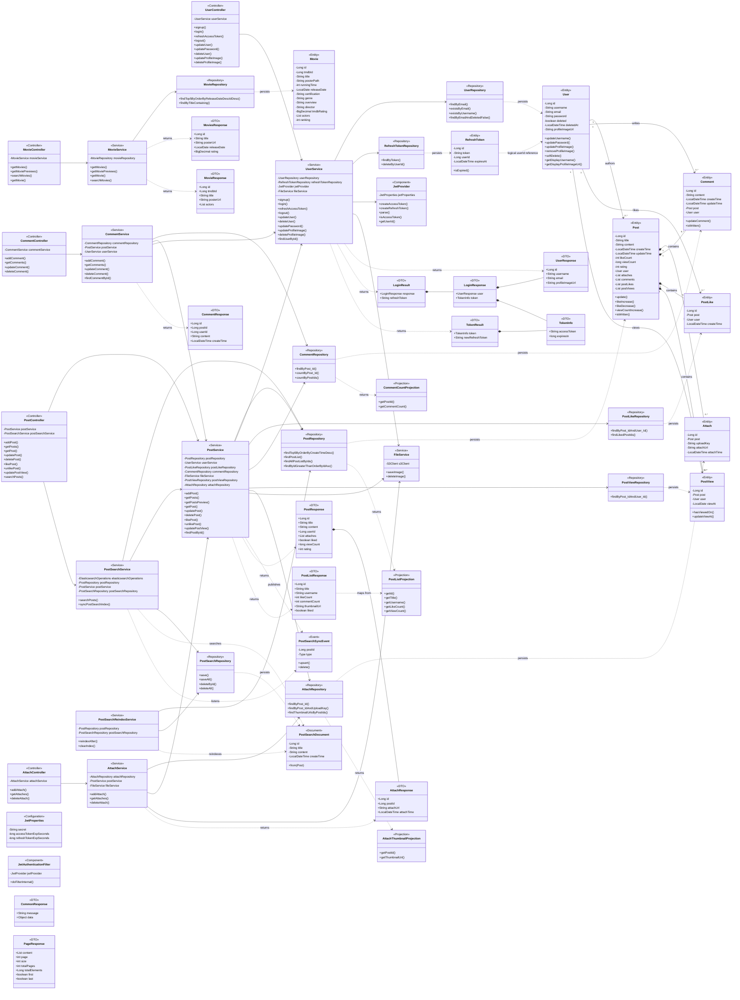

```mermaid
classDiagram
direction LR

%% Controllers
class UserController {
  -UserService userService
  +signup()
  +login()
  +refreshAccessToken()
  +logout()
  +updateUser()
  +updatePassword()
  +deleteUser()
  +updateProfileImage()
  +deleteProfileImage()
}
<<Controller>> UserController

class MovieController {
  -MovieService movieService
  +getMovies()
  +getMoviePreviews()
  +searchMovies()
  +getMovie()
}
<<Controller>> MovieController

class PostController {
  -PostService postService
  -PostSearchService postSearchService
  +addPost()
  +getPosts()
  +getPost()
  +updatePost()
  +deletePost()
  +likePost()
  +unlikePost()
  +updatePostView()
  +searchPosts()
}
<<Controller>> PostController

class CommentController {
  -CommentService commentService
  +addComment()
  +getComments()
  +updateComment()
  +deleteComment()
}
<<Controller>> CommentController

class AttachController {
  -AttachService attachService
  +addAttach()
  +getAttaches()
  +deleteAttach()
}
<<Controller>> AttachController

%% Services
class UserService {
  -UserRepository userRepository
  -RefreshTokenRepository refreshTokenRepository
  -JwtProvider jwtProvider
  -FileService fileService
  +signup()
  +login()
  +refreshAccessToken()
  +logout()
  +updateUser()
  +deleteUser()
  +updatePassword()
  +updateProfileImage()
  +deleteProfileImage()
  +findUserById()
}
<<Service>> UserService

class MovieService {
  -MovieRepository movieRepository
  +getMovies()
  +getMoviePreviews()
  +getMovie()
  +searchMovies()
}
<<Service>> MovieService

class PostService {
  -PostRepository postRepository
  -UserService userService
  -PostLikeRepository postLikeRepository
  -CommentRepository commentRepository
  -FileService fileService
  -PostViewRepository postViewRepository
  -AttachRepository attachRepository
  +addPost()
  +getPosts()
  +getPostsPreview()
  +getPost()
  +updatePost()
  +deletePost()
  +likePost()
  +unlikePost()
  +updatePostView()
  +findPostById()
}
<<Service>> PostService

class CommentService {
  -CommentRepository commentRepository
  -PostService postService
  -UserService userService
  +addComment()
  +getComments()
  +updateComment()
  +deleteComment()
  +findCommentById()
}
<<Service>> CommentService

class AttachService {
  -AttachRepository attachRepository
  -PostService postService
  -FileService fileService
  +addAttach()
  +getAttaches()
  +deleteAttach()
}
<<Service>> AttachService

class FileService {
  -S3Client s3Client
  +saveImage()
  +deleteImage()
}
<<Service>> FileService

class PostSearchService {
  -ElasticsearchOperations elasticsearchOperations
  -PostRepository postRepository
  -PostService postService
  -PostSearchRepository postSearchRepository
  +searchPosts()
  +syncPostSearchIndex()
}
<<Service>> PostSearchService

class PostSearchReindexService {
  -PostRepository postRepository
  -PostSearchRepository postSearchRepository
  +reindexAfter()
  +clearIndex()
}
<<Service>> PostSearchReindexService

%% Repositories
class UserRepository {
  +findByEmail()
  +existsByEmail()
  +existsByUsername()
  +findByEmailAndDeletedFalse()
}
<<Repository>> UserRepository

class RefreshTokenRepository {
  +findByToken()
  +deleteByUserId()
}
<<Repository>> RefreshTokenRepository

class MovieRepository {
  +findTop5ByOrderByReleaseDateDescIdDesc()
  +findByTitleContaining()
}
<<Repository>> MovieRepository

class PostRepository {
  +findTop5ByOrderByCreateTimeDesc()
  +findPostList()
  +findAllPostListByIds()
  +findByIdGreaterThanOrderByIdAsc()
}
<<Repository>> PostRepository

class CommentRepository {
  +findByPost_Id()
  +countByPost_Id()
  +countByPostIds()
}
<<Repository>> CommentRepository

class AttachRepository {
  +findByPost_Id()
  +findByPost_IdAndUploadKey()
  +findThumbnailUrlsByPostIds()
}
<<Repository>> AttachRepository

class PostLikeRepository {
  +findByPost_IdAndUser_Id()
  +findLikedPostIds()
}
<<Repository>> PostLikeRepository

class PostViewRepository {
  +findByPost_IdAndUser_Id()
}
<<Repository>> PostViewRepository

class PostSearchRepository {
  +save()
  +saveAll()
  +deleteById()
  +deleteAll()
}
<<Repository>> PostSearchRepository

%% Entities
class User {
  -Long id
  -String username
  -String email
  -String password
  -boolean deleted
  -LocalDateTime deletedAt
  -String profileImageUrl
  +updateUsername()
  +updatePassword()
  +updateProfileImage()
  +removeProfileImage()
  +softDelete()
  +getDisplayUsername()
  +getDisplayProfileImageUrl()
}
<<Entity>> User

class RefreshToken {
  -Long id
  -String token
  -Long userId
  -LocalDateTime expiresAt
  +isExpired()
}
<<Entity>> RefreshToken

class Movie {
  -Long id
  -Long tmdbId
  -String title
  -String posterPath
  -int runningTime
  -LocalDate releaseDate
  -String certification
  -String genre
  -String overview
  -String director
  -BigDecimal tmdbRating
  -List actors
  -int ranking
}
<<Entity>> Movie

class Post {
  -Long id
  -String title
  -String content
  -LocalDateTime createTime
  -LocalDateTime updateTime
  -int likeCount
  -long viewCount
  -int rating
  -User user
  -List attaches
  -List comments
  -List postLikes
  -List postViews
  +update()
  +likeIncrease()
  +likeDecrease()
  +viewCountIncrease()
  +isWritten()
}
<<Entity>> Post

class Comment {
  -Long id
  -String content
  -LocalDateTime createTime
  -LocalDateTime updateTime
  -Post post
  -User user
  +updateComment()
  +isWritten()
}
<<Entity>> Comment

class Attach {
  -Long id
  -Post post
  -String uploadKey
  -String attachUrl
  -LocalDateTime attachTime
}
<<Entity>> Attach

class PostLike {
  -Long id
  -Post post
  -User user
  -LocalDateTime createTime
}
<<Entity>> PostLike

class PostView {
  -Long id
  -Post post
  -User user
  -LocalDate viewAt
  +hasViewedOn()
  +updateViewAt()
}
<<Entity>> PostView

%% Authentication and Search
class JwtProvider {
  -JwtProperties jwtProperties
  +createAccessToken()
  +createRefreshToken()
  +parse()
  +isAccessToken()
  +getUserId()
}
<<Component>> JwtProvider

class JwtProperties {
  -String secret
  -long accessTokenExpSeconds
  -long refreshTokenExpSeconds
}
<<Configuration>> JwtProperties

class JwtAuthenticationFilter {
  -JwtProvider jwtProvider
  +doFilterInternal()
}
<<Component>> JwtAuthenticationFilter

class PostSearchDocument {
  -Long id
  -String title
  -String content
  -LocalDateTime createTime
  +from(Post)
}
<<Document>> PostSearchDocument

class PostSearchSyncEvent {
  -Long postId
  -Type type
  +upsert()
  +delete()
}
<<Event>> PostSearchSyncEvent

%% Projections
class PostListProjection {
  +getId()
  +getTitle()
  +getUsername()
  +getLikeCount()
  +getViewCount()
}
<<Projection>> PostListProjection

class CommentCountProjection {
  +getPostId()
  +getCommentCount()
}
<<Projection>> CommentCountProjection

class AttachThumbnailProjection {
  +getPostId()
  +getThumbnailUrl()
}
<<Projection>> AttachThumbnailProjection

%% DTOs
class CommonResponse {
  +String message
  +Object data
}
<<DTO>> CommonResponse

class PageResponse {
  +List content
  +int page
  +int size
  +int totalPages
  +Long totalElements
  +boolean first
  +boolean last
}
<<DTO>> PageResponse

class UserResponse {
  +Long id
  +String username
  +String email
  +String profileImageUrl
}
<<DTO>> UserResponse

class LoginResponse {
  +UserResponse user
  +TokenInfo token
}
<<DTO>> LoginResponse

class TokenInfo {
  +String accessToken
  +long expiresIn
}
<<DTO>> TokenInfo

class LoginResult {
  +LoginResponse response
  +String refreshToken
}
<<DTO>> LoginResult

class TokenResult {
  +TokenInfo token
  +String newRefreshToken
}
<<DTO>> TokenResult

class PostResponse {
  +Long id
  +String title
  +String content
  +Long userId
  +List attaches
  +boolean liked
  +long viewCount
  +int rating
}
<<DTO>> PostResponse

class PostListResponse {
  +Long id
  +String title
  +String username
  +int likeCount
  +int commentCount
  +String thumbnailUrl
  +boolean liked
}
<<DTO>> PostListResponse

class CommentResponse {
  +Long id
  +Long postId
  +Long userId
  +String content
  +LocalDateTime createTime
}
<<DTO>> CommentResponse

class AttachResponse {
  +Long id
  +Long postId
  +String attachUrl
  +LocalDateTime attachTime
}
<<DTO>> AttachResponse

class MoviesResponse {
  +Long id
  +String title
  +String posterUrl
  +LocalDate releaseDate
  +BigDecimal rating
}
<<DTO>> MoviesResponse

class MovieResponse {
  +Long id
  +Long tmdbId
  +String title
  +String posterUrl
  +List actors
}
<<DTO>> MovieResponse

%% Controller dependencies
UserController --> UserService
MovieController --> MovieService
PostController --> PostService
PostController --> PostSearchService
CommentController --> CommentService
AttachController --> AttachService

%% Service dependencies
UserService --> UserRepository
UserService --> RefreshTokenRepository
UserService --> JwtProvider
UserService --> FileService

MovieService --> MovieRepository

PostService --> PostRepository
PostService --> UserService
PostService --> PostLikeRepository
PostService --> CommentRepository
PostService --> PostViewRepository
PostService --> AttachRepository
PostService --> FileService
PostService ..> PostSearchSyncEvent : publishes

CommentService --> CommentRepository
CommentService --> PostService
CommentService --> UserService

AttachService --> AttachRepository
AttachService --> PostService
AttachService --> FileService

PostSearchService --> PostRepository
PostSearchService --> PostService
PostSearchService --> PostSearchRepository
PostSearchService ..> PostSearchDocument : searches
PostSearchService ..> PostSearchSyncEvent : listens

PostSearchReindexService --> PostRepository
PostSearchReindexService --> PostSearchRepository
PostSearchReindexService ..> PostSearchDocument : reindexes

%% Entity relationships
User "1" --> "0..*" Post : authors
User "1" --> "0..*" Comment : writes
User "1" --> "0..*" PostLike : likes
User "1" --> "0..*" PostView : views

Post "1" *-- "0..*" Attach : owns
Post "1" *-- "0..*" Comment : contains
Post "1" *-- "0..*" PostLike : contains
Post "1" *-- "0..*" PostView : contains

RefreshToken ..> User : logical userId reference

%% Repository mappings
UserRepository ..> User : persists
RefreshTokenRepository ..> RefreshToken : persists
MovieRepository ..> Movie : persists
PostRepository ..> Post : persists
CommentRepository ..> Comment : persists
AttachRepository ..> Attach : persists
PostLikeRepository ..> PostLike : persists
PostViewRepository ..> PostView : persists
PostSearchRepository ..> PostSearchDocument : persists

PostRepository ..> PostListProjection : returns
CommentRepository ..> CommentCountProjection : returns
AttachRepository ..> AttachThumbnailProjection : returns

%% DTO mappings
LoginResponse *-- UserResponse
LoginResponse *-- TokenInfo
LoginResult *-- LoginResponse
TokenResult *-- TokenInfo
PostResponse *-- AttachResponse

PostListResponse ..> PostListProjection : maps from
UserService ..> UserResponse : returns
UserService ..> LoginResult : returns
UserService ..> TokenResult : returns
MovieService ..> MoviesResponse : returns
MovieService ..> MovieResponse : returns
PostService ..> PostResponse : returns
PostService ..> PostListResponse : returns
CommentService ..> CommentResponse : returns
AttachService ..> AttachResponse : returns
```